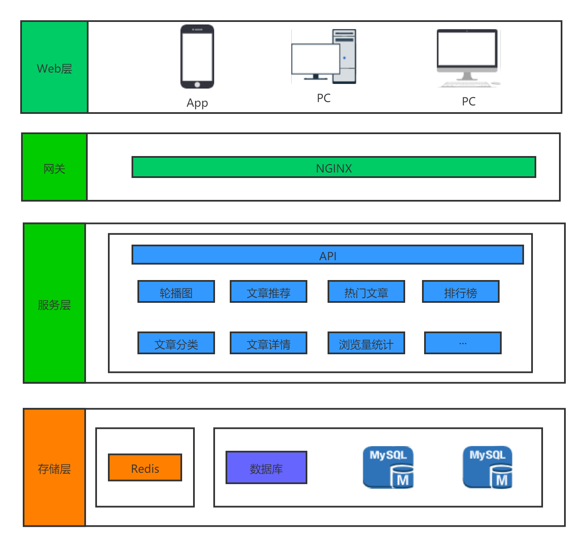

### 前言
新闻网站是在2019年11月份工作室全体成员完成的比较完成的项目。

**注：** 具体的展示代码就不上传了，因为涉及到商用。

### 网站的简单介绍

#### 简介及技术

- 主要是对国际上相关新闻的展示。
- 服务端：PHP+ThinkPHP5+MySQL+Redis+Git+Nginx。
- 客户端：向服务端请求数据，完成自身的行为逻辑。
#### 基本架构

### 主要实现的功能和用到的技术
#### 主要负责
- 完成了前端有关新闻api的编写。
- 完成了13主分类下新闻数据内容的处理。
- 首页+列表页+图文页+推荐页共有约15个数据模块的渲染的完成(包括轮播部分、精品推荐、热门文章、最新新闻等)。
### 数据库的优化
#### mysql相关表中对字段类型的优化。
- 尽可能使用更小的数据类型。
- 尽可能的定义NOT NULL字段，所有字段都有默认值。
- 没有用到变成字段（varchar）,采用固定大小的记录。
- 通过EXPLAIN查看SQL语句的执行设置合理的索引。
#### 查询语句中具体优化到的内容
- Limit跟ORDER BY 一起使用。
- date类型有频繁比较使用 unsigned int。
- 避免函数索引，走全盘扫面。
- 利用profiling和EXPLAIN分析查询语句，索引是否被利用，是否生成临时表，是否文件排序等。
#### 利用Redis来完成频繁的update
当用户每查看一篇文章的时候都会，增加一条阅读量，如果频繁的对数据库update，会很好性能。所以将每一次的更新使用redis的incr进行暂时存储。每隔一定的时间端进行定期写入。
##### key的设计
这里我主要是用的string类型：  
- key1:  article:articleID:2:pv     //存储相应文章的id  
- key2:  article:articleID:2:cateid //存储对应分类的cateid  
- key2:  categorys:cateid:4:view    //对应分类的关注量  
- 当文章增加1的时候相应的分类view(关注量也要增加一)
#### Validate(参数校验)
- 参数效验主要用的是tp5中验证器。
- 将验证器抽象出一个验证层使代码更简洁具有拦截器的作用
- 具体实现请查看：https://liruoning.cn/2019/12/31/11-tp5-validate/#mores
#### Exception(异常处理层)
异常处理在接口编写中扮演着一个不可替代的作用。
小程序中，主要将异常分为两大类：
- 由于客户的行为导致的异常。  
**例:**  
没有通过验证器，没有查询到结果。  
**特性：**  
1.通常不记录日志。    
2.需要向用户返回具体的信息。  
- 服务器自身产生的异常。      
**例:**  
代码错误，调用外部接口错误。  
**特性：**      
1.通常记录日志  
2.不向客户端返回具体信息。  
- 具体实现请查看：https://liruoning.cn/2020/01/02/12-tp5-Exception/  
#### 接口实现的功能
- 首页接口数据完成：轮播图，专题推荐，单独分类展示块的内容。
  

- 推荐页完成了：要问推荐、精选推荐、热门文章等接口。
  

- list页相关分类下以列表的形式展示文章以及加载更多，最热新闻接口等。
  

- 图文页主要是对文章内容的展示。热门文章推荐、精品推荐等接口。
  

### 接口文档
- 使用的工具：showDoc
- 接口内容：接口的调用方式+对数据接口内容的展示+接口字段的解释+错误码的说明。
